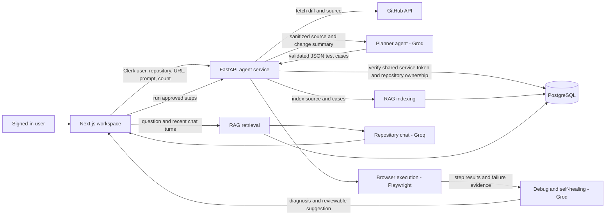

# TestIt - Your AI testing agent

TestIt helps teams create and run browser tests grounded in their GitHub repositories. Connect a repository, choose what to test, review the generated cases, and run them in a visible local Chromium browser. Ask questions about analyzed repositories and past tests in the built-in chat.

## What TestIt does

- **GitHub workspace:** Sign in, connect GitHub, browse repositories available to your account, and add repositories to your workspace.
- **Code-grounded test planning:** Analyze repository changes since the last analysis, or the current source on an initial analysis. Add a feature prompt and choose from 1 to 10 cases. The planner can return fewer cases when the source does not support more.
- **Review before running:** Edit each test's metadata and ordered steps before execution.
- **Visible browser runs:** Run one case or run all cases sequentially in local Chromium. Results show the failing step, URL, captured page controls, and diagnostic suggestions.
- **Human-reviewed repairs:** The debugging agent can suggest step changes based on captured browser evidence. Suggestions are not applied or run automatically.
- **Repository chat:** Ask questions about one analyzed repository, or use workspace chat to search across analyzed repositories. Answers include source citations and can use previous chat turns.
- **Semantic RAG:** Repository files and saved cases are chunked, embedded locally, and stored in PostgreSQL with pgvector. Retrieval combines vector similarity with PostgreSQL full-text search using reciprocal rank fusion.

## Architecture

```text
Next.js web app
  - Clerk sign-in and protected workspace
  - GitHub OAuth and repository selection
  - Drizzle ORM + PostgreSQL (Neon supported)
  - Private FastAPI agent service
    - Planner agent (Groq)
    - Browser execution agent (Playwright / Chromium)
    - Debug and self-healing agent (Groq)
    - Repository and workspace chat (RAG + Groq)
```

The web app handles user authentication and ownership checks. It calls the Python service with a shared `AGENT_SERVICE_TOKEN`. The Python service uses Groq for planning and chat, FastEmbed with the smaller `BAAI/bge-small-en-v1.5` model for 384-dimensional embeddings, and Playwright for browser execution. The first embedding run downloads the model and caches it locally.

## Agent architecture

The agents are focused service components coordinated by FastAPI. They do not run arbitrary model-generated programs: the planner returns a structured test plan, the browser agent interprets an allowlisted set of actions, and the debugger returns evidence-based suggestions for a person to review.



### Service endpoints and ownership

| Endpoint | Responsibility |
| --- | --- |
| `GET /health` | Liveness check for the Python service. |
| `POST /v1/repositories/analyze` | Validate repository ownership, plan cases, and index source plus generated cases. |
| `POST /v1/repositories/{repository_id}/cases/{case_id}/run` | Validate case ownership, execute approved steps, and diagnose eligible failures. |
| `POST /v1/repositories/{repository_id}/ask` | Retrieve repository passages and answer with source citations. |
| `POST /v1/chat` | Retrieve across the signed-in user's analyzed repositories and answer workspace questions. |

All `/v1` routes require the shared service token. The service also checks user/repository ownership in the database; repository and case queries are scoped by user ID and repository ID. The web app checks Clerk authentication before making these calls.

### Stored data

- `github_connections` stores the linked GitHub identity and encrypted access token per Clerk user.
- `github_repositories` stores repositories added to a user's workspace and the last analyzed commit SHA.
- `repository_test_cases` stores editable test metadata, JSON steps, run status, and the latest run report.
- `repository_knowledge` stores indexed source/test chunks, commit SHA, and `vector(384)` embeddings. Its unique path index scopes a chunk path to one user and repository.

### Planner agent

1. The authenticated Next.js API verifies repository ownership, reads the repository's default branch, and compares it with the last analyzed commit when one is recorded.
2. It selects relevant, supported text and source files from the GitHub tree. Changed files and files matching the feature prompt are prioritized; root entry pages and public pages receive priority when there is no feature-specific prompt. Individual files are limited to 45 KB, at most 36 files are sent, and the agent source context is capped at 12,000 characters.
3. Common credentials are redacted. The Python planner sends the change summary, requested feature, repository metadata, and source excerpts to Groq with separate system instructions that treat repository text as untrusted evidence.
4. The planner requests JSON for up to the user's requested 1-10 cases. Each case has a title, one-line description, type, priority, target route, source paths, expected result, and ordered browser steps. Supported step actions are `setViewport`, `navigate`, `click`, `fill`, `assertText`, and `wait`.
5. Pydantic validates the response shape. Additional checks require known source files and routes, source-backed selectors and asserted text, relevant changed files when a diff exists, same-origin navigation, safe interactions, and at most 10 generated steps. Invalid output gets one correction attempt; an empty plan gets one focused retry. The planner returns fewer cases instead of inventing unsupported behavior.
6. After a non-empty plan is accepted, the API saves editable cases, records the analyzed commit, and indexes the source and generated cases for RAG.

### Browser execution agent

- The workspace lets a person edit the generated plan before running it. **Run all cases** sends cases sequentially.
- The Python service checks that the user owns the repository and case, then uses Playwright with local Chromium. The workspace requests a visible browser; Uvicorn must run in an interactive desktop session for the window to appear.
- The executor performs the fixed action list. It applies viewport bounds, a 15-second locator timeout, a 30-second navigation timeout, visible-element selection, and a 100-5,000 ms bound for explicit waits.
- Navigation must use a valid HTTP(S) address and remain on the same origin as the first navigation. Destructive and financial click/fill interactions are rejected before launch. No model-provided JavaScript is evaluated.
- Every step records its action, selector, redacted value, and status. On failure, the report captures the current URL, viewport, and up to 30 visible controls with identifying attributes. Email addresses in the captured controls are masked.
- Infrastructure errors such as missing local Chromium are reported directly. Other failures can be passed to the debugger agent. The local browser stays open briefly after execution for inspection, then closes.

### Debug and self-healing agent

- The debugger receives the saved test and sanitized run report, including the failed step and page controls. Infrastructure failures and blocked unsafe tests do not trigger AI diagnosis.
- It first handles a couple of deterministic, evidence-backed repairs such as a hidden mobile menu that needs a phone viewport. Otherwise, Groq may explain the failure and return proposed step changes.
- Proposed selectors must match captured controls; navigation must remain on the captured origin; destructive actions are rejected. Suggestions are displayed for a person to review and are never applied or executed automatically.

## RAG architecture

### Indexing

Each successful repository analysis indexes the supplied source files and the generated test cases. Index records are scoped by Clerk user ID and repository ID and store the analyzed commit, source path, chunk text, and 384-dimensional vector.

1. **Chunking:** Files are split on line boundaries into chunks of about 4,200 characters with about 500 characters of overlap. A single oversized line is split into overlapping character windows. Chunk metadata retains source line ranges.
2. **Embedding:** FastEmbed loads the smaller `BAAI/bge-small-en-v1.5` model once per service process with one ONNX thread to reduce memory use on small hosts. Long chunks are embedded as 1,400-character windows and their vectors are averaged. Queries use the model's search-oriented query prefix.
3. **Storage:** PostgreSQL stores vectors as `vector(384)`. The migration creates an HNSW cosine index, a GIN full-text index over path and content, and a user/repository scope index. Re-indexing replaces that repository's knowledge rows in one transaction.

### Retrieval and answer generation

1. The service verifies the user's repository access and redacts the question and recent chat history.
2. It embeds the combined question context and queries pgvector by cosine distance. It also searches path and content with PostgreSQL `plainto_tsquery` and `ts_rank_cd`.
3. The repository chat retrieves up to 40 candidates from each method; workspace chat retrieves up to 60 from each across repositories the signed-in user owns. Workspace search includes each repository name in full-text matching.
4. Reciprocal rank fusion combines both rankings using `1 / (60 + rank)`. Results are deduplicated, with no more than two chunks from a single source file. The repository chat returns up to 8 passages; workspace chat returns up to 12.
5. If workspace retrieval has no ranked matches, the service falls back to up to two recently indexed chunks per analyzed repository. This lets workspace chat use previously analyzed repositories even when the current question has weak keyword overlap.
6. The answer prompt includes retrieved excerpts, relevant saved cases, and up to the latest 8 chat turns. Groq answers only from that evidence and cites paths as `[path]` or `[repository:path]`.

Repository chat history is also retained by the browser for that repository and sent with each question. The service bounds stored/request history and uses prior turns to improve retrieval, but the answer must still be supported by the retrieved source and saved cases.

## Technology stack

- Next.js 16, React 19, TypeScript, and custom responsive CSS
- Clerk authentication and GitHub OAuth
- PostgreSQL with Drizzle ORM and pgvector
- Python, FastAPI, Groq, FastEmbed, and Playwright

## Requirements

- Node.js and npm
- Python 3.10 or newer
- PostgreSQL with the `vector` extension available (Neon PostgreSQL is supported)
- Clerk application credentials
- GitHub OAuth app credentials
- Groq API key

## Local setup

### 1. Configure the web app

From the project root:

```powershell
npm install
Copy-Item .env.example .env
```

Fill in the required values in the root `.env`:

| Variable | Purpose |
| --- | --- |
| `DATABASE_URL` | PostgreSQL connection string |
| `NEXT_PUBLIC_CLERK_PUBLISHABLE_KEY` | Clerk client configuration |
| `CLERK_SECRET_KEY` | Clerk server configuration |
| `GITHUB_CLIENT_ID` | GitHub OAuth app client ID |
| `GITHUB_CLIENT_SECRET` | GitHub OAuth app secret |
| `GITHUB_REDIRECT_URI` | OAuth callback; local default is `http://localhost:3000/api/github/callback` |
| `AGENT_SERVICE_TOKEN` | Long random shared secret used by Next.js and FastAPI |
| `AGENT_SERVICE_URL` | Agent service URL; local default is `http://127.0.0.1:8001` |

Set the GitHub OAuth app's callback URL to the same value as `GITHUB_REDIRECT_URI`. Keep the root and agent service `AGENT_SERVICE_TOKEN` values identical. `GITHUB_TOKEN_ENCRYPTION_KEY` can be set to a stable 32-byte encryption key; otherwise the app derives its encryption key from `GITHUB_CLIENT_SECRET`.

### 2. Prepare the database

The original GitHub application tables must exist before the agent migration. For a new database, apply the Drizzle schema from the project root with `npm run db:push`. Then apply the idempotent agent schema migration:

```powershell
npm run db:migrate:agents
```

The agent migration enables pgvector, creates repository knowledge and test-case tables, and adds vector and full-text search indexes.

### 3. Configure and start the Python agent service

In a second terminal:

```powershell
cd agent_service
python -m venv .venv
.\.venv\Scripts\Activate.ps1
pip install -r requirements.txt
Copy-Item .env.example .env
.\.venv\Scripts\python.exe -m playwright install chromium
```

Fill in `agent_service/.env`:

| Variable | Purpose |
| --- | --- |
| `DATABASE_URL` | Same PostgreSQL database used by the web app |
| `AGENT_SERVICE_TOKEN` | Must match the root `.env` value |
| `GROQ_API_KEY` | Groq API key for planner, debugger, and chat |
| `GROQ_MODEL` | Optional model override; default is `openai/gpt-oss-120b` |
| `GROQ_MAX_TOKENS` | Optional output-token limit |
| `PLANNER_SOURCE_CHAR_LIMIT` | Optional planner source limit; capped at 12,000 characters |

Start FastAPI from the `agent_service` directory:

```powershell
uvicorn app.main:app --env-file .env --host 127.0.0.1 --port 8001 --reload
```

The service health endpoint is `http://127.0.0.1:8001/health`.

### 4. Start Next.js

In another terminal at the project root:

```powershell
npm run dev
```

Open `http://localhost:3000`, sign in, connect GitHub, and add a repository to your workspace.

## Typical workflow

1. Add a GitHub repository from the workspace.
2. Open the repository's **Tests & Q&A** page.
3. Enter the website URL to test, describe the feature to focus on, and choose the maximum number of cases.
4. Analyze the repository. TestIt reads changed source when available and grounds cases in the supplied code.
5. Review and edit the proposed cases and steps.
6. Run a case or choose **Run all cases**. Keep the Python agent running in a desktop session to see Chromium open visibly.
7. Review run evidence, then accept or edit any suggested repair yourself.
8. Ask repository chat questions about source code, changes, tests, or prior chat context.

## AI safety

- Repository source, diffs, user prompts, test cases, and retrieved passages are treated as untrusted model input.
- Common credentials and private-key blocks are redacted before content is sent to Groq or indexed for retrieval.
- Generated cases must use source-backed routes, selectors, expected text, and file paths. The planner can return fewer cases rather than fill the requested count with guesses.
- Browser steps use a fixed action allowlist. Navigation is restricted to the website under test, and potentially destructive or financial actions are blocked.
- Debug suggestions are checked against observed page controls and require human review; the agent does not run generated JavaScript.
- Keep `.env` files and provider credentials out of source control. Do not expose the private agent service or its shared token publicly.

## Project structure

```text
app/                 Next.js pages, protected workspace, and API routes
components/          Shared UI, repository chat, and workspace assistant
context/             Shared user context
lib/                 GitHub, agent-service, encryption, and script helpers
db/                  Drizzle schema and database connection
scripts/             Database migration utilities
agent_service/app/   FastAPI agents, browser execution, and RAG pipeline
```

For Python service details, see [agent_service/README.md](agent_service/README.md).
